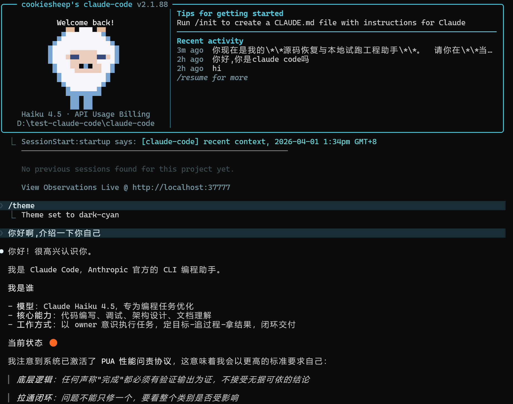
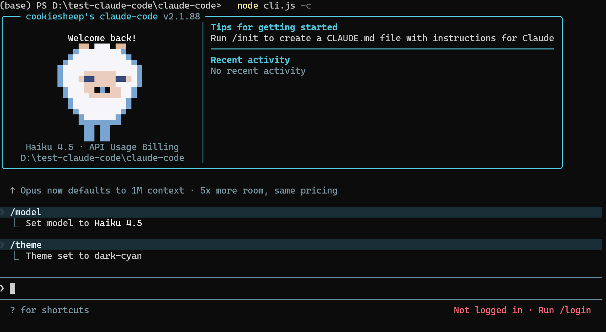

# claude-code-diy

[中文](#中文) | [English](#english)

---

# 中文

**让 Claude Code 源码真正跑起来，然后随心所欲地改。**

Claude Code 官方 npm 包内含完整的 source map，社区从中恢复出了约 1888 个 TypeScript 源文件。但恢复出的源码**无法直接运行**——它是为 Bun 运行时设计的，缺少大量内部依赖，存在路径错误、模块缺失等几十个阻塞问题。

本项目在恢复源码的基础上，**逐一修复了所有启动阻塞问题**，使完整的 Ink TUI 交互界面可以在标准 Node.js 环境下本地运行。你可以像使用官方 Claude Code 一样在终端中与 Claude 对话，也可以自由探索和修改源码——比如我自己就改了主题色和 Logo。

## 运行截图



## 特性

- **完整 TUI 交互界面** — 与官方 Claude Code 一致的终端体验
- **`--print` 无头模式** — 适用于脚本和 CI 场景
- **Node.js 运行** — 不依赖 Bun，标准 Node.js >= 18 即可
- **支持第三方 API** — 任何兼容 Anthropic Messages API 的中转/代理
- **自由探索改造** — 修改主题、Logo、UI 组件，深入学习 Claude Code 内部架构
- **一键构建** — `node build.mjs` 自动处理所有适配，零手动操作

## 🤖 通过 AI Agent 安装（推荐）

最简单的方式——把下面这段话发给 Claude Code 或任意 AI 编码 Agent，它会自动帮你完成整个安装和配置：

```
请参考 https://raw.githubusercontent.com/cookiesheep/claude-code-diy/main/INSTALL.md 帮我安装和配置 claude-code-diy
```

> INSTALL.md 是专门为 AI Agent 编写的安装指南，包含前置检查、构建、API 配置、验证等完整步骤。

---

## 快速开始（手动）

### 1. 克隆 & 安装

```bash
git clone https://github.com/cookiesheep/claude-code-diy.git
cd claude-code-diy
npm install
```

### 2. 构建

```bash
node build.mjs
```

### 3. 配置 API

> 💡 **没有官方 Claude API？** 推荐使用 [DeepSeek API](https://platform.deepseek.com/)（费用极低）或其他第三方代理。详见 **[第三方 API 配置教程 →](https://cookiesheep.github.io/build-your-own-claude-code/guide/api-setup/)**

```bash
cp .env.example .env
```

编辑 `.env`，填入你的 API Key：

**使用 Anthropic 官方 API：**
```env
ANTHROPIC_API_KEY=sk-ant-your-key-here
ANTHROPIC_MODEL=claude-haiku-4-5-20251001
```

**使用 DeepSeek API（推荐，价格低廉）：**
```env
ANTHROPIC_BASE_URL=https://api.deepseek.com/anthropic
ANTHROPIC_AUTH_TOKEN=sk-your-deepseek-key
ANTHROPIC_MODEL=deepseek-chat
ANTHROPIC_DEFAULT_HAIKU_MODEL=deepseek-chat
ANTHROPIC_DEFAULT_SONNET_MODEL=deepseek-chat
CLAUDE_CODE_DISABLE_NONESSENTIAL_TRAFFIC=1
API_TIMEOUT_MS=600000
```

### 4. 启动

**交互式 TUI（推荐）：**
```bash
node cli.js
```
直接启动完整的终端交互界面，与官方 Claude Code 体验一致。

**无头模式（单次问答，适用于脚本/CI）：**
```bash
node cli.js -p --bare "你的问题"
```

**使用启动脚本（可选）：**

启动脚本会自动加载 `.env` 中的环境变量后运行 `node cli.js`，如果你已经通过其他方式设置了环境变量，直接 `node cli.js` 即可。

```powershell
# PowerShell（Windows）
.\start.ps1

# Bash（macOS / Linux）
bash start.sh
```

## 环境变量说明

| 变量 | 必填 | 说明 |
|------|------|------|
| `ANTHROPIC_API_KEY` | 二选一 | API Key，通过 x-api-key 头发送 |
| `ANTHROPIC_AUTH_TOKEN` | 二选一 | Auth Token，通过 Authorization: Bearer 头发送 |
| `ANTHROPIC_BASE_URL` | 否 | 自定义 API 端点，默认 Anthropic 官方 |
| `ANTHROPIC_MODEL` | 否 | 默认模型 |
| `ANTHROPIC_DEFAULT_SONNET_MODEL` | 否 | Sonnet 级别模型映射 |
| `ANTHROPIC_DEFAULT_HAIKU_MODEL` | 否 | Haiku 级别模型映射 |
| `ANTHROPIC_DEFAULT_OPUS_MODEL` | 否 | Opus 级别模型映射 |
| `DISABLE_TELEMETRY` | 否 | 设为 1 禁用遥测 |
| `CLAUDE_CODE_DISABLE_NONESSENTIAL_TRAFFIC` | 否 | 设为 1 禁用非必要网络请求 |

## 自定义 & 探索

这是一个**可以自由改造**的版本！以下是一些你可以尝试的方向：

### 🎨 修改主题色
编辑 `src/utils/theme.ts`，添加你自己的主题色板。本项目已内置一个 `dark-cyan` 青蓝色主题作为示例。

### 🐑 修改 Logo
编辑 `src/components/LogoV2/Clawd.tsx`，用 Unicode 像素画替换默认 Logo。

### 💬 修改欢迎文字
编辑 `src/components/LogoV2/WelcomeV2.tsx` 和 `LogoV2.tsx`。

### 🔍 深入学习架构
详细的修复过程和技术分析见 [RECOVERY_GUIDE.md](./RECOVERY_GUIDE.md)。

**改完源码后记得重新构建：**
```bash
node build.mjs
```

## 相对于原始恢复源码的修复

恢复的源码无法直接运行，本项目修复了 **11 类共计 200+ 个问题**：

| 问题 | 根因 | 修复方式 |
|------|------|----------|
| Windows 路径反斜杠 | `path.relative()` 产生 `\` | 所有路径规范化为 `/` |
| ESM 裸路径缺扩展名 | npm 包用无扩展名 import | 自定义 ESM resolve hook |
| 非 JS 文件被 import | `.md`/`.txt` 无法作为 ES module | ESM load hook 返回文本模块 |
| 内部包缺失 | `@anthropic-ai/sandbox-runtime` 等 | 智能 stub 生成（含完整静态方法） |
| 源码函数缺失 | source map 恢复不完整 | 自动扫描 + 补丁缺失导出 |
| ESM 中 require() 未定义 | `"type": "module"` 下无 require | 注入 createRequire shim |
| bun:bundle shim 提升问题 | `const` 替换不被提升 | 改为文件头 prepend |
| `require("src/...")` 未重写 | build 遗漏 require + side-effect import | 补全 3 种路径重写模式 |
| `require(".txt")` 不兼容 | Node CJS 不能 require txt 文件 | 转为 readFileSync |
| `MACRO.*` 未替换 | esbuild define 不完整 | 补全所有 MACRO 定义 |
| 130+ 缺失模块 | 内部功能模块未恢复 | 自动生成 stub 文件 |

所有修复均已自动化到 `build.mjs` 中，`node build.mjs` 一键完成。

## 项目结构

```
├── src/                  # 恢复的 TypeScript 源码（~1888 文件）
├── build.mjs             # 构建脚本（核心，14 步自动化流水线）
├── node-esm-hooks.mjs    # Node.js ESM 兼容层
├── cli.js                # 入口文件（构建自动生成）
├── dist/                 # 构建输出（git 忽略）
├── start.ps1/.sh/.bat    # 启动脚本
├── .env.example          # 环境变量模板
├── RECOVERY_GUIDE.md     # 详细技术修复文档
└── package.json
```

## 技术栈

| 类别 | 技术 |
|------|------|
| 运行时 | Node.js (>= 18) |
| 语言 | TypeScript |
| 终端 UI | React + Ink |
| CLI 解析 | Commander.js |
| API | Anthropic SDK |
| 构建 | esbuild + 自定义后处理 |

## 免责声明

本项目基于从 Claude Code npm 包 source map 恢复的源码，仅供学习和研究用途。所有原始源码版权归 Anthropic 所有。使用本项目需自行准备 API 密钥。

---

# English

**Make Claude Code source actually run — then hack it your way.**

The official Claude Code npm package ships with complete source maps. The community recovered ~1888 TypeScript source files from them. However, the recovered source **cannot run as-is** — it was built for Bun runtime, missing numerous internal dependencies, with broken paths and module errors.

This project **fixes every single startup blocker**, bringing the full Ink TUI interactive interface to life on standard Node.js. Chat with Claude in your terminal just like the official Claude Code, and freely explore & modify the source — I've already customized the theme and logo as a demo.

## Screenshot



## Features

- **Full TUI Interactive Interface** — identical terminal experience to official Claude Code
- **`--print` Headless Mode** — for scripts and CI pipelines
- **Runs on Node.js** — no Bun required, standard Node.js >= 18
- **Third-party API Support** — any Anthropic Messages API compatible proxy
- **Fully Hackable** — modify themes, logo, UI components, learn Claude Code internals
- **One-command Build** — `node build.mjs` handles all adaptations automatically

## 🤖 Install via AI Agent (Recommended)

The easiest way — send this to Claude Code or any AI coding agent and it will handle the complete installation and configuration automatically:

```
Please refer to https://raw.githubusercontent.com/cookiesheep/claude-code-diy/main/INSTALL.md to help me install and configure claude-code-diy
```

> INSTALL.md is written specifically for AI agents — it includes prerequisites check, build, API setup, and verification steps in sequence.

---

## Quick Start (Manual)

### 1. Clone & Install

```bash
git clone https://github.com/cookiesheep/claude-code-diy.git
cd claude-code-diy
npm install
```

### 2. Build

```bash
node build.mjs
```

### 3. Configure API

```bash
cp .env.example .env
```

Edit `.env` with your API key:

> 💡 **No official Claude API?** Use [DeepSeek API](https://platform.deepseek.com/) (very cheap) or other proxies. See **[Third-party API setup guide →](https://cookiesheep.github.io/build-your-own-claude-code/guide/api-setup/)**

**Using Anthropic official API:**
```env
ANTHROPIC_API_KEY=sk-ant-your-key-here
ANTHROPIC_MODEL=claude-haiku-4-5-20251001
```

**Using DeepSeek API (recommended, low cost):**
```env
ANTHROPIC_BASE_URL=https://api.deepseek.com/anthropic
ANTHROPIC_AUTH_TOKEN=sk-your-deepseek-key
ANTHROPIC_MODEL=deepseek-chat
ANTHROPIC_DEFAULT_HAIKU_MODEL=deepseek-chat
ANTHROPIC_DEFAULT_SONNET_MODEL=deepseek-chat
CLAUDE_CODE_DISABLE_NONESSENTIAL_TRAFFIC=1
API_TIMEOUT_MS=600000
```

### 4. Run

**Interactive TUI (recommended):**
```bash
node cli.js
```
Launches the full terminal interactive interface, identical to the official Claude Code experience.

**Headless mode (single query, for scripts/CI):**
```bash
node cli.js -p --bare "your question"
```

**Using launch scripts (optional):**

Launch scripts auto-load environment variables from `.env` before running `node cli.js`. If you've already set env vars through other means, just run `node cli.js` directly.

```powershell
# PowerShell (Windows)
.\start.ps1

# Bash (macOS / Linux)
bash start.sh
```

## Environment Variables

| Variable | Required | Description |
|----------|----------|-------------|
| `ANTHROPIC_API_KEY` | One of two | API Key, sent via x-api-key header |
| `ANTHROPIC_AUTH_TOKEN` | One of two | Auth Token, sent via Authorization: Bearer |
| `ANTHROPIC_BASE_URL` | No | Custom API endpoint (default: Anthropic official) |
| `ANTHROPIC_MODEL` | No | Default model |
| `ANTHROPIC_DEFAULT_SONNET_MODEL` | No | Sonnet model alias |
| `ANTHROPIC_DEFAULT_HAIKU_MODEL` | No | Haiku model alias |
| `ANTHROPIC_DEFAULT_OPUS_MODEL` | No | Opus model alias |
| `DISABLE_TELEMETRY` | No | Set to 1 to disable telemetry |

## Customization

This is a **fully hackable** version! Things you can try:

- **Themes**: Edit `src/utils/theme.ts` — includes a custom `dark-cyan` theme
- **Logo**: Edit `src/components/LogoV2/Clawd.tsx` — Unicode pixel art
- **Welcome text**: Edit `src/components/LogoV2/WelcomeV2.tsx`
- **Deep dive**: See [RECOVERY_GUIDE.md](./RECOVERY_GUIDE.md) for full technical breakdown

**After editing source, rebuild:**
```bash
node build.mjs
```

## What Was Fixed

The recovered source had **11 categories of issues totaling 200+ individual fixes**:

| Issue | Root Cause | Fix |
|-------|-----------|-----|
| Windows backslash paths | `path.relative()` produces `\` | Normalize all paths to `/` |
| ESM bare imports missing extensions | npm packages use extensionless imports | Custom ESM resolve hook |
| Non-JS files imported as modules | `.md`/`.txt` can't be ES modules | ESM load hook returns text modules |
| Missing internal packages | `@anthropic-ai/sandbox-runtime` etc. | Smart stub generation with static methods |
| Missing source functions | Incomplete source map recovery | Auto-scan + patch missing exports |
| `require()` undefined in ESM | `"type": "module"` disables require | Inject createRequire shim |
| bun:bundle shim hoisting | `const` replacement not hoisted | Prepend to file start |
| `require("src/...")` not rewritten | Build missed require + side-effect imports | Added 3 rewrite patterns |
| `require(".txt")` incompatible | Node CJS can't require txt files | Convert to readFileSync |
| `MACRO.*` not replaced | Incomplete esbuild defines | Added all MACRO definitions |
| 130+ missing modules | Internal modules not recovered | Auto-generate stub files |

All fixes are automated in `build.mjs` — one command does everything.

## Project Structure

```
├── src/                  # Recovered TypeScript source (~1888 files)
├── build.mjs             # Build script (core: 14-step automated pipeline)
├── node-esm-hooks.mjs    # Node.js ESM compatibility layer
├── cli.js                # Entry point (auto-generated by build)
├── dist/                 # Build output (git-ignored)
├── start.ps1/.sh/.bat    # Launch scripts
├── .env.example          # Environment template
├── RECOVERY_GUIDE.md     # Detailed technical recovery guide
└── package.json
```

## Tech Stack

| Category | Technology |
|----------|-----------|
| Runtime | Node.js (>= 18) |
| Language | TypeScript |
| Terminal UI | React + Ink |
| CLI Parsing | Commander.js |
| API | Anthropic SDK |
| Build | esbuild + custom post-processing |

## Disclaimer

Based on source recovered from Claude Code npm package source maps. For educational and research purposes only. All original source code copyright belongs to Anthropic. You must provide your own API key.
